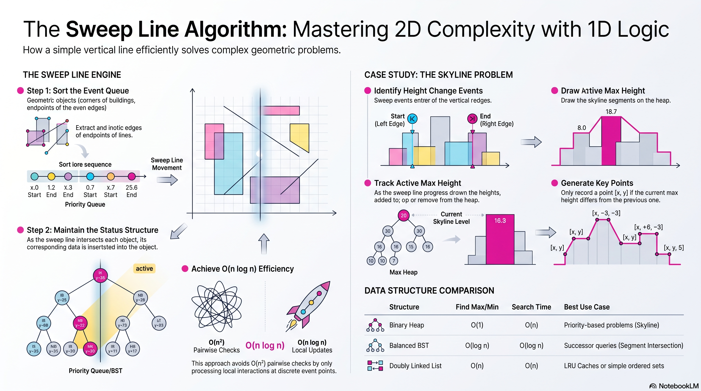

<div align="center">


<br/>

[](LeetCode_patternz.html)
[](LeetCode_patternz.html)
[](LeetCode_patternz.html)
[](LeetCode_patternz.html)

<br/><br/>


</div>

---

## About

**LeetCode Patternz** is an interview-ready pattern guide built for FAANG-level preparation. Instead of grinding random problems, you learn to **recognize signals**, apply the right **template**, and solve with confidence under pressure.

Every pattern includes:

- **Signal phrases** — what the problem statement is really asking
- **Code template** — copy-ready skeleton you can adapt in an interview
- **Complexity tags** — time and space at a glance
- **Curated problems** — hand-picked LeetCode questions per pattern

---

## What's Inside

| Resource | Description |
|----------|-------------|
| [`LeetCode_patternz.html`](LeetCode_patternz.html) | **Interactive Pattern Engine** — 27 architectures across 5 tiers. Filter by category, expand cards for templates, track revision with built-in checkboxes. |
| [`Binary Search On Answers/`](Binary%20Search%20On%20Answers/) | Visual guide for parametric search — `minimize the maximum`, `is_valid(mid)`, monotonic answer spaces. |
| [`Sweep_Line/`](Sweep_Line/) | Sweep-line architecture — dimensional reduction for skyline, meeting rooms, and interval union problems. |

---

## Pattern Engine — 5 Tiers · 27 Architectures

<div align="center">


</div>

Open [`LeetCode_patternz.html`](LeetCode_patternz.html) in your browser for the full interactive experience.

| Tier | Focus | Patterns | Color |
|:----:|-------|:--------:|:-----:|
| **1** | Core Engines — Arrays, Windows, Intervals | 7 | `#7C6AFF` |
| **2** | Data Structures — Stacks, Heaps, Linked Lists | 6 | `#FF6A9E` |
| **3** | Graphs & Trees — BFS, DFS, Union-Find | 5 | `#6AFFD4` |
| **4** | Dynamic Programming — 1D, 2D, State Machines | 5 | `#FFD06A` |
| **5** | Advanced — Bits, Backtracking, Fenwick | 4 | `#FF9F6A` |

<details>
<summary><b>Full Pattern Index</b></summary>

<br/>

**Tier 1 — Core Engines**  
`Two Pointers` · `Dynamic Sliding Window` · `Prefix Sum + Hash Map` · `Kadane's Algorithm` · `Dutch National Flag` · `Rotated Binary Search` · `Binary Search on Answer Space`

**Tier 2 — Data Structures**  
`Monotonic Stack` · `Monotonic Deque` · `Min Heap / Top K` · `Fast & Slow Pointers` · `LRU Cache Design` · `Trie (Prefix Tree)`

**Tier 3 — Graphs & Trees**  
`BFS Level Order` · `DFS on Trees/Graphs` · `Topological Sort` · `Union-Find (DSU)` · `Dijkstra / Shortest Path`

**Tier 4 — Dynamic Programming**  
`1D DP (House Robber)` · `2D Grid DP` · `Knapsack / Subset Sum` · `LCS / LIS` · `State Machine DP`

**Tier 5 — Advanced Engines**  
`Backtracking` · `XOR Engine` · `Brian Kernighan's Algorithm` · `Binary Indexed Tree (Fenwick)`

</details>

---

## Visual Deep Dives

<table>
<tr>
<td align="center" width="50%">

### Binary Search on Answers


When you see *"minimize the maximum"* or *"maximize the minimum"* — the answer lives in a sorted space. Build `is_valid(mid)`, binary search the range.

</td>
<td align="center" width="50%">

### Sweep Line Algorithm



Reduce 2D geometry to 1D events. The backbone behind skyline problems, meeting room overlaps, and interval unions.

</td>
</tr>
</table>

---

## Repository Structure

```text
LeetCode_Patternz/
├── LeetCode_patternz.html          # Interactive pattern revision engine
├── Binary Search On Answers/
│   └── Binary_Search_on_Answer_Guide.png
├── Sweep_Line/
│   └── Sweep_Line_Algorithm_Overview.png
└── README.md
```

---

## Quick Start

```bash
git clone https://github.com/mujii88/LeetCode_Patternz.git
cd LeetCode_Patternz

# Open the pattern engine
xdg-open LeetCode_patternz.html    # Linux
open LeetCode_patternz.html         # macOS
start LeetCode_patternz.html        # Windows
```

**Study workflow**

1. Pick a tier in `LeetCode_patternz.html` and read the signal phrases
2. Memorize the template — rewrite it from memory on paper
3. Solve 2–3 curated problems per pattern before moving on
4. Mark cards done and track progress toward 100% coverage

---

<div align="center">


<br/>

[](https://github.com/mujii88)
[](https://github.com/mujii88/LeetCode_Patternz)

</div>
