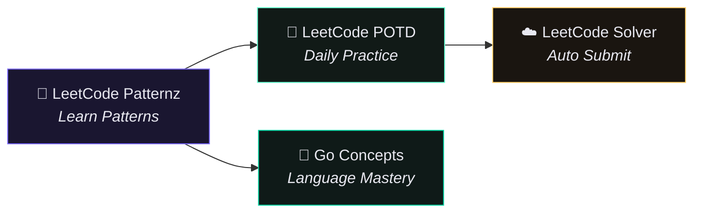

<div align="center">

<!-- Animated gradient header -->


<!-- Typing animation -->


<br/>

<!-- Badges row -->
[](LeetCode_patternz.html)
[](LeetCode_patternz.html)
[](GO_GUIDE.html)
[](https://github.com/mujii88/LeetCode_POTD)
[](https://github.com/sirsyedcasecase-hub/solver)

<br/><br/>


</div>

---

## The Ecosystem

> **One mission — crack FAANG interviews through patterns, consistency, and automation.**  
> This hub connects every LeetCode repository in the stack. Learn the patterns here, solve daily on POTD, automate submissions with the solver, and sharpen Go skills alongside.



---

## Repository Map

<table>
<tr>
<td width="50%" valign="top">

### 🧠 [LeetCode Patternz](https://github.com/mujii88/LeetCode_Patternz) — *You are here*

The **command center** for interview preparation. Interactive HTML engines, visual guides, and deep-dive content for the hardest algorithm families.

| Resource | Description |
|----------|-------------|
| [`LeetCode_patternz.html`](LeetCode_patternz.html) | **Google Master Matrix** — 27 patterns across 5 tiers with signal recognition, code templates, complexity tags, and curated problem lists. Track progress with built-in checkboxes. |
| [`GO_GUIDE.html`](GO_GUIDE.html) | **Go Developer's Bible** — complete language reference from types to generics, pointers, and concurrency. |
| [`Go_first_section.html`](Go_first_section.html) | Day 1 & 2 notes distilled into an interview-ready Go primer. |
| [`Go_Second_Section.html`](Go_Second_Section.html) | Advanced Go deep dive — structs, interfaces, goroutines, and design patterns. |
| [`Binary Search On Answers/`](Binary%20Search%20On%20Answers/) | Video walkthrough, PDF guide, and visual overview for parametric search. |
| [`Sweep_Line/`](Sweep_Line/) | Dimensional reduction & sweep-line architecture with animated explainer. |

**Color palette:** `#7C6AFF` violet · `#FF6A9E` rose · `#6AFFD4` mint · `#FFD06A` gold · `#0A0A0F` void

</td>
<td width="50%" valign="top">

### 📅 [LeetCode POTD](https://github.com/mujii88/LeetCode_POTD)

**Daily Problem of the Day** journal — started June 9, 2026. Not a code dump; every solution is a teaching artifact.

- Clean, production-level implementations in **Python · C++ · Go**
- Heavy inline explanations — intuition, edge cases, and complexity analysis
- Brute force → optimal solution journeys where applicable
- Organized by **Year → Month** for easy navigation

```
📦 LeetCode_POTD
 ┣ 📂 2026
 ┃ ┣ 📂 06_June
 ┃ ┃ ┣ 📜 09_Subarray_Sums_Divisible_by_K.py
 ┃ ┃ ┗ 📜 ...
 ┃ ┗ 📂 07_July
```

*"Consistency is the architecture of mastery."*

</td>
</tr>
<tr>
<td width="50%" valign="top">

### ☁️ [LeetCode Solver](https://github.com/sirsyedcasecase-hub/solver)

**Hands-free daily submissions** powered by GitHub Actions. Zero cost, zero PC required.

| Feature | Detail |
|---------|--------|
| Schedule | Cron-fired workflow runs ~30 sec/day |
| Smart retry | Tries top-5 community solutions on failure |
| Languages | Python, Java, C++, JS, TS, Go, Rust |
| Trigger | Manual run from Actions tab anytime |

```
GitHub Actions cron
   → solver.py fetches today's problem
   → pulls top community solution
   → extracts code block
   → submits & polls judge
   → ✅ Accepted (or retries)
```

</td>
<td width="50%" valign="top">

### 🐹 [Go Concepts](https://github.com/mujii88/Go_Concepts)

Companion repo for **Go language fundamentals** — the language layer beneath your algorithm practice. Pairs directly with the three Go HTML guides in this repository.

- Core syntax, types, and control flow
- Slices, maps, structs, and interfaces
- Error handling, generics, and concurrency primitives
- Interview-focused examples and idioms

</td>
</tr>
</table>

---

## Pattern Engine — 5 Tiers · 27 Architectures

<div align="center">


</div>

Open [`LeetCode_patternz.html`](LeetCode_patternz.html) in your browser for the full interactive experience — filter by tier, expand cards for templates, and track your revision progress.

| Tier | Focus | Patterns | Accent |
|:----:|-------|:--------:|:------:|
| **1** | Core Engines — Arrays, Windows, Intervals | 7 | `#7C6AFF` |
| **2** | Data Structures — Stacks, Heaps, Linked Lists | 6 | `#FF6A9E` |
| **3** | Graphs & Trees — BFS, DFS, Union-Find | 5 | `#6AFFD4` |
| **4** | Dynamic Programming — 1D, 2D, State Machines | 5 | `#FFD06A` |
| **5** | Advanced — Bits, Backtracking, Fenwick | 4 | `#FF9F6A` |

<details>
<summary><b>🔍 Full Pattern Index</b> — click to expand</summary>

<br/>

**Tier 1 — Core Engines**
`Two Pointers` · `Dynamic Sliding Window` · `Prefix Sum + Hash Map` · `Kadane's Algorithm` · `Dutch National Flag` · `Rotated Binary Search` · `Binary Search on Answer Space`

**Tier 2 — Data Structures**
`Monotonic Stack` · `Monotonic Deque` · `Min Heap / Top K` · `Fast & Slow Pointers` · `LRU Cache Design` · `Trie (Prefix Tree)`

**Tier 3 — Graphs & Trees**
`BFS Level Order` · `DFS on Trees/Graphs` · `Topological Sort` · `Union-Find (DSU)` · `Dijkstra / Shortest Path`

**Tier 4 — Dynamic Programming**
`1D DP (House Robber)` · `2D Grid DP` · `Knapsack / Subset Sum` · `LCS / LIS` · `State Machine DP`

**Tier 5 — Advanced Engines**
`Backtracking` · `XOR Engine` · `Brian Kernighan's Algorithm` · `Binary Indexed Tree (Fenwick)`

</details>

---

## Visual Deep Dives

<table>
<tr>
<td align="center" width="50%">

### Binary Search on Answers


Parametric search demystified — when to recognize `minimize the maximum`, how to build the `is_valid(mid)` predicate, and why the answer space is always monotonic.

📁 [`Binary_Search_on_Answer.pdf`](Binary%20Search%20On%20Answers/Binary_Search_on_Answer.pdf) · 🎬 `Binary_Search_on_Answer.mp4`

</td>
<td align="center" width="50%">

### Sweep Line Algorithm


Dimensional reduction in algorithms — transform 2D geometry into 1D event processing. The architecture behind skyline, meeting rooms, and interval union problems.

🎬 `Dimensional_Reduction_in_Algorithms.mp4`

</td>
</tr>
</table>

---

## Quick Start

```bash
# Clone the hub
git clone https://github.com/mujii88/LeetCode_Patternz.git
cd LeetCode_Patternz

# Open the pattern engine in your browser
xdg-open LeetCode_patternz.html    # Linux
open LeetCode_patternz.html         # macOS
start LeetCode_patternz.html        # Windows
```

**Recommended workflow:**

1. **Learn** — Study patterns in `LeetCode_patternz.html`, mark cards as done
2. **Practice** — Solve the curated problems, then follow [LeetCode POTD](https://github.com/mujii88/LeetCode_POTD) daily
3. **Automate** — Set up [LeetCode Solver](https://github.com/sirsyedcasecase-hub/solver) for streak maintenance
4. **Level up Go** — Work through `GO_GUIDE.html` + [Go Concepts](https://github.com/mujii88/Go_Concepts)

---

<div align="center">


<br/>

**Patterns don't lie. Consistency wins.**

[](https://github.com/mujii88)
[](https://github.com/mujii88/LeetCode_Patternz)

</div>
